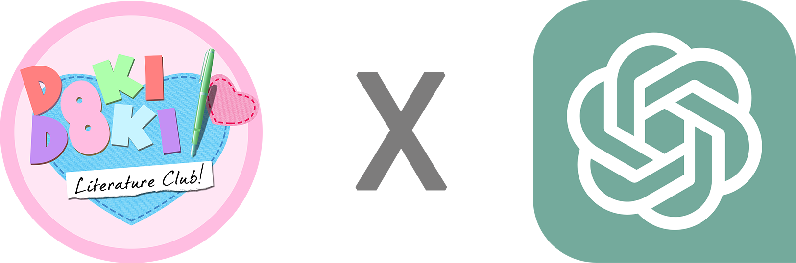

# DDLC Worlds Apart

Immerse yourself in an unparalleled dialogue experience with the members of the Literature Club. DDLC AI extends beyond pre-scripted responses, introducing fluid, generative, and memory-rich interactions.



## Table of Contents

- [About](#about) 📖
- [Notes](#notes) 📝 
- [Features](#features) 🎮
- [Technology](#technology) 🧠
- [Installation](#installation) 🛠️
- [Credits](#credits) 🙏

## About

DDLC Worlds Apart reimagines the way you engage with the Literature Club members. While the current version places you in the familiar clubroom, future iterations will unveil more environments and opportunities for exploration.

**Character Status:**
- **Monika**: 🟢 Active
- **Sayori**: 🟠 Coming Soon
- **Natsuki**: 🟠 Coming Soon
- **Yuri**: 🟠 Coming Soon
- **MC**: ❓

## Notes

- DDLC Worlds Apart is a work in progress. Expect bugs and missing features.

- DDLC Worlds Apart is not affiliated with Team Salvato. DDLC AI is a fan project.

- DDLC Worlds Apart is not a replacement for DDLC. It begins after the events of DDLC.

- Sometimes the AI gets stuck in a process, I try to fix this error. For now, just restart the AI.

- This mod stores Monika Memories in a MongoDB database, if you don't want to use it, it also can sotore them in a JSON file. By default, it uses a JSON file.

- I'm making a video about this project, I will upload it to my YouTube channel (named IkarosKurtz), I will put the link here when is ready.

## Features

- **Generative Conversations**: Speak freely and receive human-like responses.
- **Memory-Rich Interactions**: The AI recalls past discussions, making every conversation nuanced and unique.
- **Expansive Environments**: The clubroom is just the beginning.

## Technology

At the core of DDLC AI is a Generative Agent, inspired by cutting-edge research from Google and Stanford University. Powering these interactions is ChatGPT, specifically the `gpt-3.5-turbo` variant, boasting 175 billion parameters.

📄 [Generative Agents: Interactive Simulacra of Human Behavior](https://arxiv.org/pdf/2304.03442.pdf)

Our bespoke implementation introduces optimizations, ensuring faster and seamless dialogues. A cornerstone of our project is the long-term memory system, obviating the conventional token limitations and archiving essential memories in MongoDB. Note: Usage of ChatGPT necessitates charges for the OpenAI API.

## Installation

**Prerequisites**:

1. [Python](https://www.python.org/downloads/) - For backend processes.
2. DDLC Worlds Apart Repository.

**Setup**:

### AI Setup
1. Clone or download this repository.
2. Navigate to the project directory.
3. Initiate a virtual environment:
```
python -m venv env
```
4. Activate the virtual environment:
```
env\Scripts\activate
```
5. Install dependencies:
```
pip install -r requirements.txt
```
6. Configure your .env:
  * `OPENAI_API_KEY`: Your OpenAI API Key.
  * `MONGO_URI`: Your MongoDB Connection URI. (Optional)

7. Run the AI:
```
python api.py
```  

### MOD Setup

1. Download the rar from releases tab [here](https://github.com/IkarosKurtz/DDLC-Worlds-Apart/releases/tag/v0.0.1-alpha).
2. Extract the rar. You should get a folder called `DDLC Worlds Apart`.
3. Get a fresh copy of DDLC from [here](https://ddlc.moe/).
4. Copy/move all the contents of the `DDLC Worlds Apart` folder into the root of your DDLC folder. When prompted to replace files select `Yes`, basically you are replacing the original files with the modded files.
5. Run `DokiDokiWorldsAparts.exe`, also run the AI (follow the AI Setup).
6. Last but not least, enjoy!

## Credits
A heartfelt appreciation to Google, Stanford University, and OpenAI for their invaluable research and tools. This project stands on the shoulders of their pioneering work.

Dan Salvato and Team Salvato for creating such an amazing game and community.

